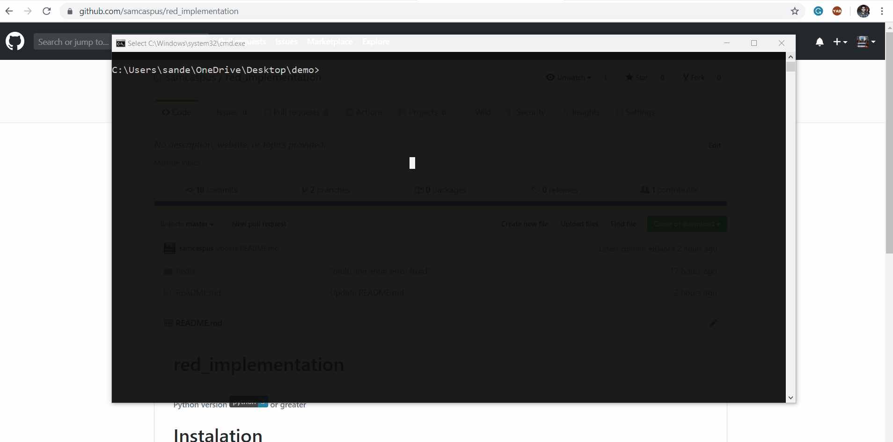

# Requirement
###### Python version  or greater

# Setup 
#### Clone command => git clone https://github.com/samcaspus/red_implementation
#### Go to directory => cd red_implementation/Redis/
#### execute command => python redis.py

## Commands Implemented
- Append (append key data)
- Del (del key)
- Exists (exists key)
- Exit (exit)
- Expire (expire key timeInSeconds)
- Get (get key)
- Getrange (get key rangeStart rangeEnd) user for strings
- Set (set key data)
- Zadd (set key dataInPairs)
- Zrange and Zrange withscores (zrange key startRange endRange) or (zrange key startRange endRange withscores)
- Zrank (zrank key pairData)
- ttl (ttl key)
- lpush (lpush key listDataInSpaces)
- rpush (rpush key listDataInSpaces)
- lindex (lindex key data)
- linsert (linsert key valueOfWhichDataIsToBeInsertedBeforeOf value)
- rinsert (linsert key valueOfWhichDataIsToBeInsertedAfterOf value)
- llen (llen key)
- rpop (rpop key)
- lpop (lpop key)
- lrange (lrange key startRange endRange)

## Demo

